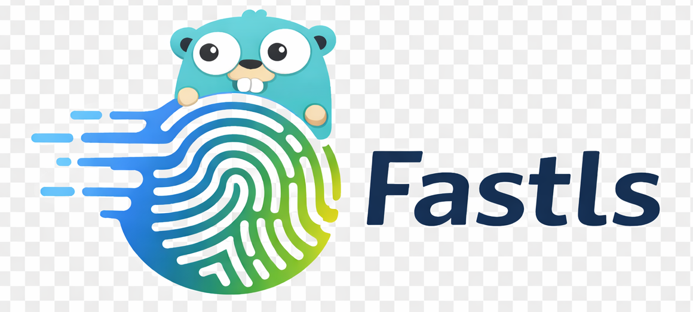

<div align="center">
  
  
  # Fastls
  
  高性能 TLS 指纹伪装库，支持 JA3/JA4R 指纹和浏览器模拟。
  
  > [English](./README_EN.md) | 中文
</div>

## 特性

- ✅ 高性能 - 内置 goroutine 池处理异步请求
- ✅ TLS 指纹伪装 - 支持 JA3 指纹，JA4R 指纹（实验性）
- ✅ 浏览器模拟 - 支持 Chrome、Firefox、Edge 等多种浏览器
- ✅ 自定义请求头顺序 - 通过 [fhttp](https://github.com/useflyent/fhttp) 实现
- ✅ 代理支持 - HTTP、HTTPS、SOCKS5
- ✅ 多种服务模式 - Fetch 服务、MITM 代理、RPC 服务（JSON-RPC/gRPC）

## 快速开始

### Go

```bash
go get github.com/ChengHoward/Fastls
```

```go
package main

import (
    "fmt"
    fastls "github.com/ChengHoward/Fastls"
    "github.com/ChengHoward/Fastls/imitate"
)

func main() {
    client := fastls.NewClient()
    
    options := fastls.Options{
        URL:    "https://tls.peet.ws/api/all",
        Method: "GET",
    }
    
    // 使用 Chrome142 指纹
    imitate.Chrome142(&options)
    
    resp, err := client.Do(options.URL, options, options.Method)
    if err != nil {
        panic(err)
    }
    defer resp.Body.Close()
    
    body, _ := io.ReadAll(resp.Body)
    fmt.Println(string(body))
}
```

## 服务模式

### Fetch 服务

基于 HTTP 的 RESTful API 服务。

```bash
cd main/fetch
go run fetch_server.go
```

### MITM 代理

支持动态生成 SSL 证书的中间人代理。

```bash
cd main/mitm
go run mitm_proxy.go -addr :8888 -browser chrome142
```

### RPC 服务

提供 JSON-RPC 2.0 和 gRPC 两种实现。

**JSON-RPC:**
```bash
cd main/rpc/jsonrpc
go run rpc_server.go
```

**gRPC:**
```bash
cd main/rpc/grpc
protoc --go_out=. --go_opt=paths=source_relative \
       --go-grpc_out=. --go-grpc_opt=paths=source_relative \
       proto/fastls.proto
go run grpc_server.go
```

## 支持的浏览器

- Chrome / Chrome120 / Chrome142
- Chromium
- Edge
- Firefox
- Safari
- Opera

## 文档

- [Fetch 服务文档](./main/fetch/README.md)
- [MITM 代理文档](./main/mitm/README.md)
- [RPC 服务文档](./main/rpc/README.md)

## License

See [LICENSE](./LICENSE) file for details.

